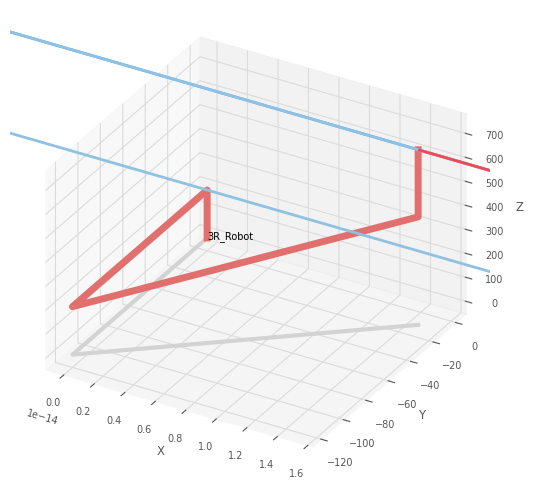
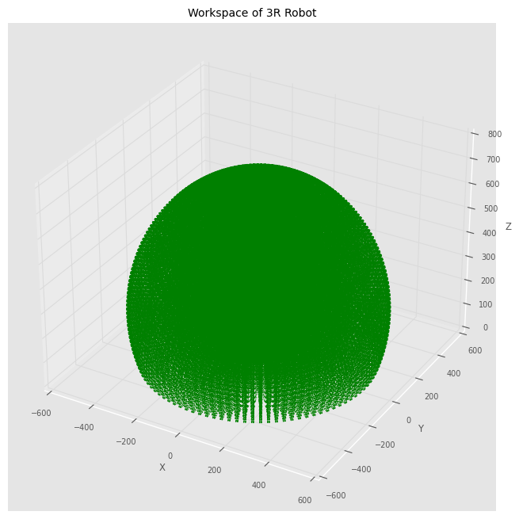
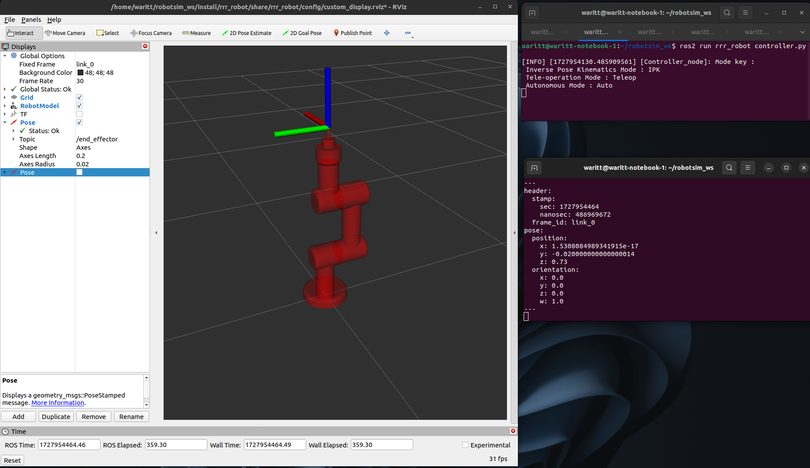
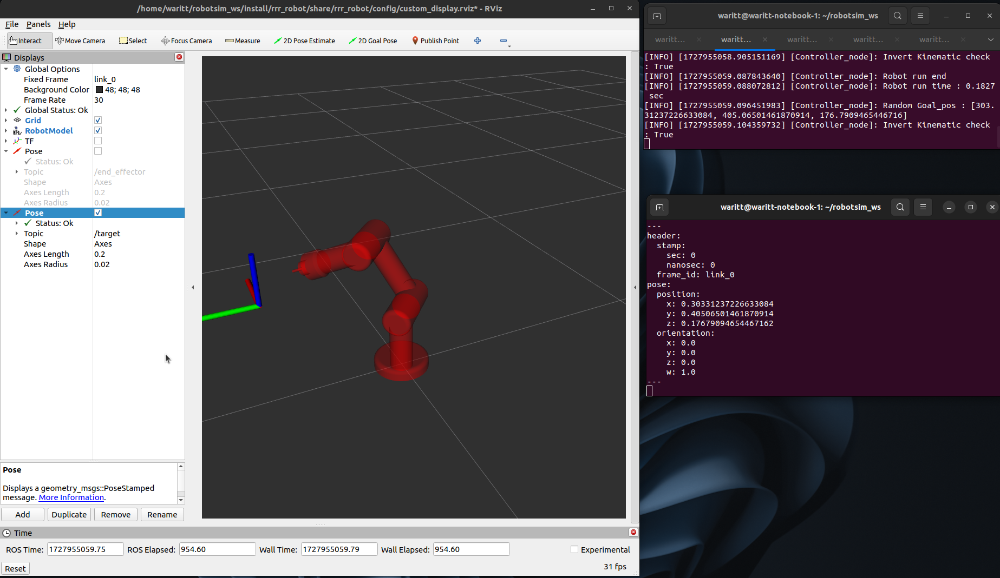

# FUN4 : 3R Robot Simulation Detail

ทำการออกแบบและสร้าง Simulation การทำงานของแขนกล 3R Robot โดยแบ่งการทำงานออกเป็น 2 ส่วน คือ
- ส่วนการหา Workspace การทำงานของแขนกล
- ส่วนการสร้างระบบควบคุมการทำงานของแขนกลที่แสดงผลผ่าน RVIZ

# Workspace of 3R Robot

ทำการหา Workspace การทำงานของแขนกล 3R Robot โดยใช้การแทนค่า configuration space ในช่วงที่แต่ละ Joint ของแขนกลลงสมการ Forward Kinematic ของแขนกล เพื่อหา Task space ของแขนกล โดยแขนกลมีรายละเอียดดังนี้


**สามารถดู code ที่ใช้ได้จากไฟล์ ' find_workspace.ipynb '**

## 3R Robot DH-Table

ทำการสร้าง DH-Table ที่แสดงลักษณะโครงสร้างของแขนกล โดยมีรายละเอียดดังนั้

``` python
# Defind DH-Table
robot = rtb.DHRobot([
        rtb.RevoluteMDH(d = 200), # joint 1
        rtb.RevoluteMDH(alpha = -pi/2 ,d = -120 ,offset = -pi/2), # joint 2
        rtb.RevoluteMDH(a = 250 ,d = 100 ,offset = pi/2), # joint 3
        rtb.RevoluteMDH(alpha = pi/2, d = 280), # End-effector
    ],
    name = "3R_Robot"
)
```
จะได้ DH-Table ดังนี้

```
DHRobot: 3R_Robot, 4 joints (RRRR), dynamics, modified DH parameters
┌──────┬────────┬───────────┬──────┐
│ aⱼ₋₁ │  ⍺ⱼ₋₁  │    θⱼ     │  dⱼ  │
├──────┼────────┼───────────┼──────┤
│  0.0 │   0.0° │        q1 │  200 │
│  0.0 │ -90.0° │  q2 - 90° │ -120 │
│  250 │   0.0° │  q3 + 90° │  100 │
│  0.0 │  90.0° │        q4 │  280 │
└──────┴────────┴───────────┴──────┘
```

จาก DH-Table เมื่อแขนกลอยู่ในท่า Home configuration สามารถ plot ได้ดังนี้



## 3R Robot workspace graph

ทำการกำหนดค่า configuration space ของแต่ละ Joint ในช่วงที่กำหนดเพื่อใช้หา Task space

```Python
# Define joint angle ranges for q1 - q3
theta1_range = np.linspace(-np.pi, np.pi, 100)  # Joint 1
theta2_range = np.linspace(-np.pi, np.pi, 100)  # Joint 2
theta3_range = np.linspace(-np.pi, np.pi, 100)  # Joint 3
```
กำหนดให้ workspace อยู่ในช่วงที่ค่า z >= 0 จะได้ workspace ดังนี้



# Show Simulation can do

ในระบบ Simulation การทำงานของแขนกล 3R Robot ประกอบด้วย Mode การทำงาน 3 mode
- Inverse Pose Kinematics Mode : IPK
- Tele-operation Mode : Teleop (ไม่เสร็จ)
- Autonomous Mode : Auto

## Custom service detail

ในระบบ Simulation การทำงานของแขนกล 3R Robot ได้มีการสร้าง custom service ขึ้นมาเพื่องานที่แตกต่างกันภายใต้ Interface 'rrr_robot_interfaces' ทั้งหมด 5 ตัว คือ

-   RRRMode : เป็น service ที่ใช้ในการเรียกเพื่อเปลี่ยนโหมดการทำงานของแขนกล

-   RRRInvertKinematics : เป็น service ที่ใช้ในการเรียกใช้ Node สำหรับหา Invert Kinematic

-   RRRTargetPub : เป็น service ที่ใช้ในการส่งตำแหน่ง target และค่า configuration space ของแต่ละ Joint ไปยัง Node สำหรับ pub ค่าไปยัง RVIZ

-   RRRIPK : เป็น service ที่ใช้ในการกำหนด Task space ของ IPk Mode 

-   RRRRandomTarget : เป็น service ที่ใช้ในการเรียกค่า Task space ของ Auto Mode จาก random_node

## Pub topic '/target' and '/end_effector' to show in RVIZ2

### topic : /end_effector

ในภาพจะแสดงค่าที่จาก topic /end_effector ใน Terminal และแสดงตำแหน่งของ frame end_effector บนแขนกลผ่าน RVIZ



### topic : /target

ในภาพจะแสดงค่าที่จาก topic /target ใน Terminal และแสดงตำแหน่งของ frame target ใน workspace ผ่าน RVIZ



## Inverse Pose Kinematics Mode (IPK)

การทำงานใน IPK Mode จะเป็นการทำงานที่ต้องกำหนด target ให้กับระบบ Simulation การทำงานของแขนกล 3R Robot ซึ่ง
- หาก target นั้นแขนกล**สามารถเคลื่อน**ที่ไปได้จะมีการ response ค่า configuration space ของแต่ละ Joint และ ค่าที่แสดงว่าสามารถเคลื่อนที่ได้ จากนั้น แขนกลจะเคลื่อนที่
- หาก target นั้นแขนกล**ไม่สามารถ**เคลื่อนที่ไปได้จะมีการ response ค่าที่แสดงว่าไม่สามารถเคลื่อนที่ได้ และแขนกลจะไม่ขยับ

**VDO แสดงการทำงานใน IPK Mode**

[VDO_run_ipk_mode](picture/VDO_run_ipk_mode.webm)

## Autonomous Mode (Auto)

แสดงการทำงาน Auto Mode

## Tele-operation Mode (Teleop)

แสดงการทำงาน Teleop Mode

## Example test VDO

VDO แสดงการทำงาน

# How to install 3R Robot Simulation

แสดงการ dowload และเรียกใช้งาน


